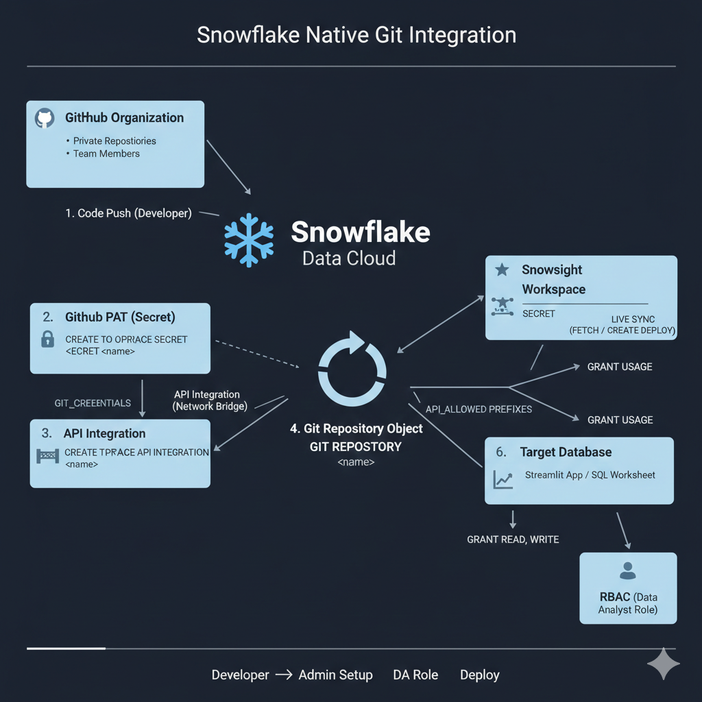

# Snowflake Git Integration: Step-by-Step Implementation

This project documents the process of connecting a Snowflake account to a GitHub repository to enable native version control.



## 🛠️ Implementation Steps

### 1. GitHub Authentication (PAT)
A **Personal Access Token (Classic)** was generated with the following specific scopes to ensure full functionality:
* **repo (Full control):** Allows Snowflake to access private repositories.
* **admin:org / admin:org_hook:** Read/Write access for organization, team membership, and projects.

### 2. GitHub Organization & Team Setup

To move from a personal workflow to a professional team environment, I transitioned the project to a GitHub Organization. This allows for centralized management of repositories and team-based permissions.

#### a. Organization Infrastructure
* **Org Creation:** Established a dedicated GitHub Organization to house all Snowflake-related assets.
* **Repository Migration:** Created the primary repository under the Organization namespace: `https://github.com/your-org-name/your-repo-name`.

#### b. Team Collaboration & Access Control
* **Member Onboarding:** Invited team members to the Organization to enable collaborative coding.
* **Permission Mapping:** Assigned roles (Read, Write, or Admin) to users to control who can modify Snowflake deployment scripts.

### 3. Role Elevation
All administrative tasks were performed under the **`ACCOUNTADMIN`** role in Snowsight to ensure proper permissions for creating security integrations.

### 4. Creating the Snowflake Secret
I stored the GitHub credentials securely within Snowflake. This prevents hardcoding sensitive tokens in scripts.

```sql
-- Role: ACCOUNTADMIN
CREATE OR REPLACE SECRET GIT_SECRET
  TYPE = PASSWORD
  USERNAME = 'Your-GitHub-Username'
  PASSWORD = 'your-classic-pat-token-here';

```
### 5. Create the API Integration
This object authorizes Snowflake to communicate with the GitHub API domain.
```sql
CREATE OR REPLACE API INTEGRATION git_api_integration
  API_PROVIDER = git_https_api
  API_ALLOWED_PREFIXES = ('https://github.com/your_org_or_user/')
  ALLOWED_AUTHENTICATION_SECRETS=(GIT_SECRET)
  ENABLED = TRUE;
```
### 6. Creating the Workspace (Direct Link)
Instead of manual repository objects, the Snowsight UI was used to create a workspace directly from the Git repository.

**Steps taken in Snowsight:**

* Repository URL: Linked to https://github.com/your-org-name/your-repo-name.git.

* **API Integration:** Selected git_org_api_integration.

* **Secret:** Provided github_org_secret (Required for private Org repos).

This creates a live-sync environment where the Snowsight workspace is powered by the code in this repository.

🔄 **Team Workflow**
* **Commit:** Team members push code to the GitHub Org repository.

* **Fetch:** Within Snowsight, use the Fetch button or command to pull latest updates.

* **Execute:** Run SQL or Python scripts directly from the version-controlled branch.

  ## 🔐 3. Governance & RBAC (Role-Based Access Control)

To ensure security and follow the principle of least privilege, I moved away from using the `ACCOUNTADMIN` role for daily operations. Instead, I established a dedicated **Data Analyst (DA)** role and configured precise permissions for Git-to-Snowflake workflows.

### A. Role & User Provisioning
I used the `USERADMIN` role to create the functional hierarchy and provision the team members.

```sql
-- Switch to User Administrator
USE ROLE USERADMIN;

-- 1. Create the functional role for developers/analysts
CREATE ROLE DA COMMENT = 'DATA ANALYST ROLE FOR GIT OPERATIONS';

-- 2. Create the end-user who will utilize the Git integration
CREATE USER <username>
    PASSWORD = '<secure_password>'
    LOGIN_NAME = '<login_name>'
    EMAIL = '<user_email>'
    MUST_CHANGE_PASSWORD = TRUE;

-- 3. Assign the DA role to the new user and yourself for testing
GRANT ROLE DA TO USER <username>;
GRANT ROLE DA TO USER <your_own_username>;
```
### B. Security & Integration Grants

The `DA` (Data Analyst) role acts as the primary operator for the Git integration. For this role to successfully fetch code or create workspaces, it requires specific **Usage** and **Read** permissions on the underlying integration objects created by the `ACCOUNTADMIN`.


#### 1. Integration Stack Access
These grants allow the `DA` role to utilize the secret credentials and the network tunnel established with GitHub.

```sql
-- Grant access to the database and schema where Git objects reside
GRANT USAGE ON DATABASE SNOWGIT TO ROLE DA;
GRANT USAGE ON SCHEMA SNOWGIT.PUBLIC TO ROLE DA;

-- Authorize the role to use the Secret and API Integration
GRANT USAGE ON SECRET GIT_SECRET TO ROLE DA;
GRANT USAGE ON INTEGRATION GIT_API_INTEGRATION TO ROLE DA;
```

